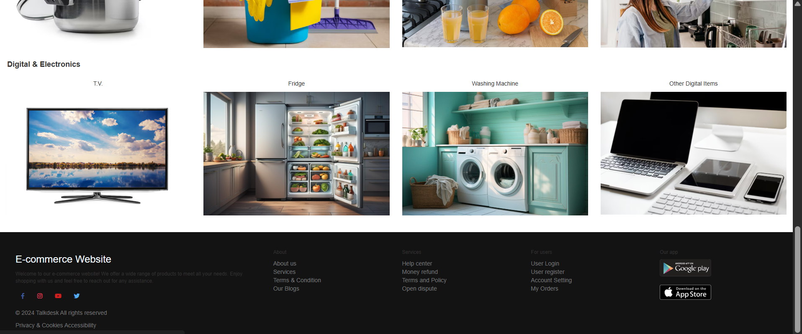
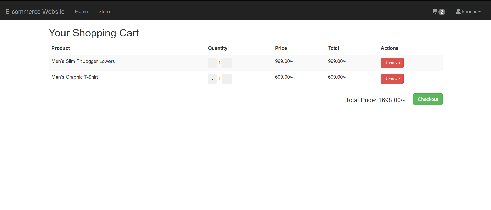
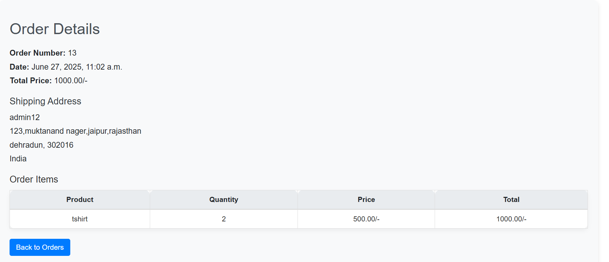

# 🛍️ Django E-Commerce Website

A full-stack E-commerce website built using Django that allows users to browse products, add them to a cart, and make purchases. Admins can manage products, categories, and orders. The website includes search functionality, responsive UI, and order tracking.

---

## 📸 Screenshots

| Homepage                          | Product Grid 1                      | Product Grid 2                      |
|----------------------------------|-------------------------------------|-------------------------------------|
|  |  |  |

| Cart Page                         | Order Details Page                  |
|----------------------------------|-------------------------------------|
|     |  |


## 🚀 Features

- 🔐 User Authentication (Register, Login, Logout)
- 📦 Product Listing by Category and Subcategory
- 🔍 Search Functionality in Navbar
- 🛒 Add to Cart and "Buy Now" Flow
- 🧾 Checkout System with Address & Contact Info
- 📬 Order Confirmation and Status Tracking
- ⚙️ Admin Panel for Product & Order Management
- 📱 Responsive UI using Bootstrap 5

---

## 🧰 Tech Stack

| Layer      | Technologies                          |
|------------|----------------------------------------|
| Backend    | Python, Django 5                       |
| Frontend   | HTML, CSS, JavaScript, Bootstrap 5     |
| Database   | SQLite (Default), Switchable to PostgreSQL/MySQL |
| Tools      | Pillow, django-crispy-forms, dotenv    |

---

## 📂 Project Structure

```
ecommerce/
│
├── ecommerce/              # Project settings & routing
├── app/                    # Main application (models, views, etc.)
├── templates/              # HTML templates
├── static/                 # Static files (CSS, JS, Images)
├── media/                  # Uploaded media files
├── screenshots/            # Screenshots for documentation
├── .env                    # Environment config (optional)
├── db.sqlite3              # SQLite database
├── requirements.txt        # Python dependencies
├── manage.py               # Django management script
└── README.md               # Project documentation
```

---

## 🧪 Setup & Installation

### 📦 1. Clone the Repository

```bash
git clone https://github.com/your-username/ecommerce-django.git
cd ecommerce-django
```

### 🧱 2. Create Virtual Environment

```bash
python -m venv venv
# Activate on Windows
venv\Scripts\activate
# On macOS/Linux
source venv/bin/activate
```

### 🧪 3. Install Dependencies

```bash
pip install -r requirements.txt
```

### 🔐 4. Configure Environment Variables (Optional)

Create a `.env` file in the root directory:

```env
SECRET_KEY=your-django-secret-key
DEBUG=True
```

You can load this using `python-dotenv`.

### 🛠️ 5. Run Migrations

```bash
python manage.py makemigrations
python manage.py migrate
```

### 👤 6. Create Superuser (Admin Login)

```bash
python manage.py createsuperuser
```

### ▶️ 7. Start the Development Server

```bash
python manage.py runserver
```

Visit: [http://127.0.0.1:8000/](http://127.0.0.1:8000/)

---

## 🔍 Requirements

The dependencies used in this project are listed below:

```
asgiref==3.8.1
crispy-bootstrap5==2024.2
Django==5.0.7
django-crispy-forms==2.3
pillow==10.4.0
python-dotenv==1.0.1
sqlparse==0.5.1
tzdata==2024.1
```

Install them with:

```bash
pip install -r requirements.txt
```

---

## 🙋 Contribution Guidelines

Contributions are welcome! To contribute:

1. Fork the repository
2. Create a new branch (`git checkout -b new-feature`)
3. Commit your changes (`git commit -m 'Add new feature'`)
4. Push to the branch (`git push origin new-feature`)
5. Create a Pull Request

